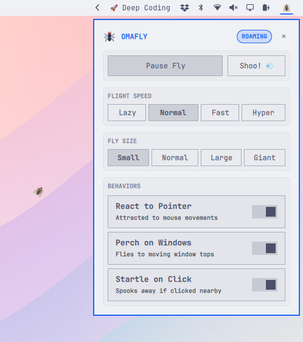

# Omafly — Desktop Fly Companion for Omarchy

A lightweight, animated desktop fly companion for **Omarchy** and **Hyprland**, ported and evolved from the original GNOME Shell extension by [Walid Rouibah](https://github.com/walrou/ambed-fly).

Omafly spawns an animated housefly that roams naturally across your screens, reacts to mouse movement, perches on moving windows, and can be startled across your workspace.

<p align="center">
  
</p>

---

## ✨ Features

- **Smooth Wing Flapping**: Authentic 3-frame animation cycling at 30 FPS (`fly_frame1.png`, `fly_frame2.png`, `fly_frame3.png`).
- **Natural Flight Dynamics**: 60 FPS physics engine with dynamic waypoint wandering, saccadic bursts, speed variations, and multi-monitor edge bouncing.
- **Random Stops & Resting**: Flies don't fly non-stop! Natural random pauses where the fly lands, folds its wings, and rests (with occasional grooming wing twitches).
- **Cursor Tracking**: Naturally curves toward the mouse pointer with velocity lead time and realistic proximity deviation.
- **Window Attraction**: Senses when your active focused window moves and flies over to land on the top border.
- **Startle & Shoo 💨**: Click near the fly, move the cursor too close while resting, or hit "Shoo!" to startle the fly into an evasive dash.
- **100% Click-Through**: Runs on a transparent Wayland layer-shell overlay (`WlrLayer.Overlay`) with an empty input mask so it never blocks windows or mouse clicks.
- **Bar Widget**: Animated fly icon in your Omarchy status bar with real-time flapping feedback and left/right click actions.
- **Control Panel**: Quick popup panel to toggle the fly, trigger "Shoo!", change flight speeds, adjust sizes, and toggle behaviors.
- **CLI & IPC Control**: Full IPC support via `omarchy-shell` for custom scripts, hotkeys, and shortcuts.

---

## 🚀 Installation & Usage

### Option A: Direct Install (Recommended)

Install and enable Omafly directly from GitHub:

```bash
omarchy plugin add https://github.com/jvlianodorneles/omafly.git --enable
```

### Option B: Local Development / Manual Install

Clone or symlink the repository into your Omarchy plugins directory:

```bash
mkdir -p ~/.config/omarchy/plugins
ln -sf ~/Projects/ambed-fly ~/.config/omarchy/plugins/dorneles.omafly
```

Then enable the plugin:

```bash
omarchy plugin enable dorneles.omafly
```

*(Optional) To place the status bar widget in a specific section:*

```bash
omarchy plugin enable dorneles.omafly --section right
```

---

## 🗑️ Uninstallation

To remove Omafly from your system:

### 1. Remove the Plugin via Omarchy CLI

```bash
omarchy plugin remove dorneles.omafly
```
*(Or using the alias: `omarchy plugin rm dorneles.omafly`)*

This automatically disables the plugin in the shell, deletes or unlinks the plugin files from `~/.config/omarchy/plugins`, and refreshes the shell.

### 2. (Optional) Remove State & Configuration

To completely remove saved preferences and state:

```bash
rm -rf ~/.local/state/omarchy/omafly
```

### 3. (Optional) Clean Up Keybindings

If you added custom shortcuts to `~/.config/hypr/bindings.lua`, remove or comment out the Omafly entries:

```lua
-- Remove these lines if previously added:
-- o.bind("SUPER + ALT + P", "Omafly: panel", "omarchy-shell dorneles.omafly-panel toggle")
-- o.bind("SUPER + ALT + F", "Omafly: toggle", "omarchy-shell dorneles.omafly toggle")
-- o.bind("SUPER + ALT + S", "Omafly: shoo", "omarchy-shell dorneles.omafly shoo")
```

---

## 🎮 Controls & Interaction

### Status Bar Widget
- **Left-Click**: Open the Omafly control panel.
- **Right-Click**: Instantly toggle the fly on or off (pause / resume).
- **Hover**: View current status, flight mode, and flight speed.

### Desktop Interaction
- **Mouse Clicks**: Clicking within 220px of the fly will startle it away.
- **Moving Windows**: Drag or move a window to watch the fly race over and land on the top title bar.

---

## ⌨️ Hyprland Keybindings

Add handy shortcuts to your `~/.config/hypr/bindings.lua`:

```lua
-- Open/Close Omafly Control Panel
o.bind("SUPER + ALT + P", "Omafly: panel", "omarchy-shell dorneles.omafly-panel toggle")

-- Toggle Omafly on/off
o.bind("SUPER + ALT + F", "Omafly: toggle", "omarchy-shell dorneles.omafly toggle")

-- Shoo the fly away!
o.bind("SUPER + ALT + S", "Omafly: shoo", "omarchy-shell dorneles.omafly shoo")
```

---

## 💻 CLI & IPC Commands

Control Omafly directly from terminal, scripts, or launchers using `omarchy-shell`:

```bash
# Open / toggle the control popup panel
omarchy-shell dorneles.omafly-panel toggle

# Toggle fly on/off
omarchy-shell dorneles.omafly toggle

# Force on / off
omarchy-shell dorneles.omafly on
omarchy-shell dorneles.omafly off

# Scare the fly across the screen
omarchy-shell dorneles.omafly shoo

# Change flight speed: lazy | normal | fast | hyper
omarchy-shell dorneles.omafly setSpeed fast

# Change visual size: small | normal | large | giant
omarchy-shell dorneles.omafly setScale large

# Toggle random stops (1 or 0)
omarchy-shell dorneles.omafly setRandomStops 1

# Query real-time status (JSON)
omarchy-shell dorneles.omafly status
```

---

## 📦 Dependencies & Requirements

Omafly runs out of the box on a standard Omarchy environment with zero third-party packages or pip modules required:

- **Omarchy Shell & Quickshell** (Qt Quick layer-shell integration and bar widget hosting)
- **Hyprland** (Wayland compositor providing UNIX sockets for pointer coordinates and window events)
- **Python 3** (used by `tracker.py`; relies exclusively on Python standard library modules: `struct`, `select`, `fcntl`, `socket`, `json`, `os`, `sys`, `time`)

---

## 📂 Architecture

- **`manifest.json`**: Omarchy plugin manifest (schema version 1) declaring `kinds: ["overlay", "bar-widget"]`.
- **`Overlay.qml`**: Fullscreen layer-shell overlay window instantiated per screen. Hosts the physics simulation, frame animation, and IPC handler.
- **`BarWidget.qml`**: Status bar button with animated wings, tooltip, and popup loader.
- **`Panel.qml`**: Popup settings and control panel built with Omarchy's `KeyboardPanel` and theme components.
- **`tracker.py`**: Background Python daemon that reads pointer position from the Hyprland UNIX socket, window move events from `socket2.sock`, and mouse clicks from `/dev/input/event*`.
- **`assets/`**: Original animation frames (`fly_frame1.png`, `fly_frame2.png`, `fly_frame3.png`) and vector `icon.svg`.

---

## 📜 Credits & License

- Original GNOME extension by **[Walid Rouibah](https://github.com/walrou/ambed-fly)** (`walrou/ambed-fly`).
- Ported and enhanced for Omarchy & Quickshell by **Juliano Dorneles**.
- Licensed under **GPL-3.0-or-later**.
